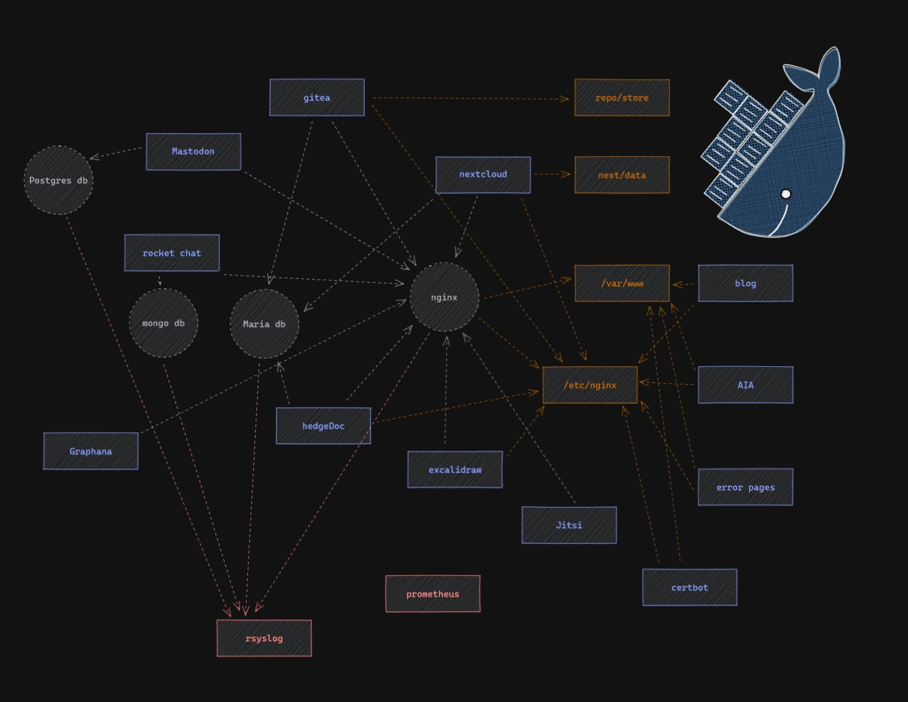

# CollaBootstrap

This is a collection of Docker containers and images that provide a quick way to deploy a collaboration platform for a nonprofit or small organization.

## Docker Containers and images

nginx
mongo db
postgres db
maria db

Rocket Chat
NextCloud
Jitsi
Headgedoc
Graphana
Gitea
Excalidraw
